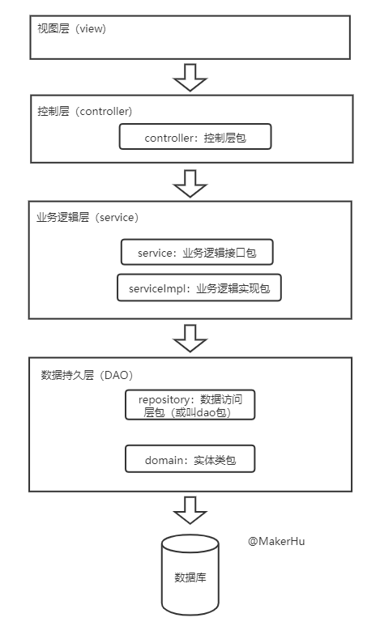
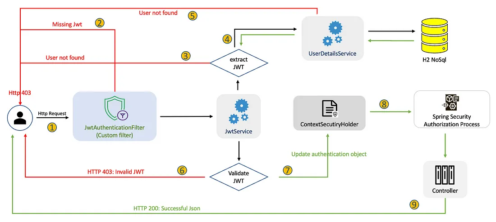

# pisa-test
1. 开发一个类似pisa的测试平台

# 项目架构图

1. 开发时自底向上比较清晰

# 依赖项
1. mysql版本：5.7.x
2. java version：17
3. spring boot 3.x
4. mybatis + mybatis-generator
5. mapstruct 1.5.5.Final

# 开发要点
1. 架构图、页面设计、实体图和数据库表设计：https://www.processon.com/diagrams
2. 数据流转自底向上：mapper -> do -> entity -> dto
3. 开发自底向上：repository -> service -> controller
4. 登录权限设计：spring security + jwt
    